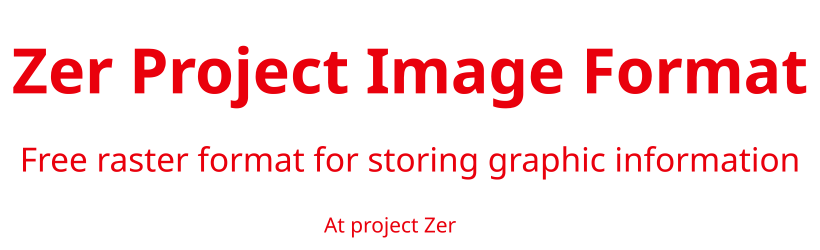

**English (translation)**

# Description of the ZPIF File Format

ZPIF (ZerProjectImageFormat) is a raster format for storing graphical information.

## Format Structure

The file consists of three main parts:

1. **Image Parameters**: Define the basic properties of the file.
2. **Commands**: Mark the beginning of pixel data and the end of the file.
3. **Pixel Data**: Store the colors of the pixels.

## Image Parameters

Parameters are enclosed in curly braces `{}`. Each parameter has a name and a value. The value is written in parentheses `()`, where the name specifies the parameter type, and the value specifies its content.

### Supported Parameters

#### Mandatory Parameters:

- `{format} (ZPIFv1)` - File format. Specifies the image type.
- `{mode} (RGB)` - Display mode. Currently, only RGB is supported.
- `{width} (1920)` - Image width in pixels.
- `{height} (1080)` - Image height in pixels.
- `{compression} (RLE)` - Compression method. If omitted, the default value is `0`. Currently, only RLE is supported.

#### Optional Parameters:

- `{data} (2025-01-04)` - File creation date.
- `{time} (14:30:00)` - File creation time.
- `{data_unix} (1735691400)` - Date and time in UNIX format.

## Commands

Commands are written in the format `@@` and define the structure of the image data:

- `@s@` - Marks the beginning of pixel data.
- `@e@` - Marks the end of the file.

## Writing Order

1. Image parameters are written first, in any order.
2. After the parameters, the `@s@` command indicates the beginning of pixel data.
3. The `@e@` command is written at the end of the file.

## Pixel Data

- Pixels are written in the format `[RGB]` (each letter represents 1 byte of color), where the values represent the intensities of the RGB colors.
- When using RLE compression, parentheses `()` may precede the pixel description, containing the count of repeated pixels. Example: `(10)[255 0 0]` means 10 consecutive red pixels.
- Pixels are written from left to right, top to bottom.

## Example 1 of a ZPIF File (Binary Representation):

```zpif
{format} (zpifv1)
{mode} (rgb)
{width} (4)
{height} (2)
{compression} (RLE)
{data} (2025-01-04)
{time} (14:30:00)
{data_unix} (1735691400)
@start@
(5) [\xFF\x80\x40]
[\xFF\xFF\x40]
(2) [\xFF\x80\x41]
@end@
```

## Example 2 of a ZPIF File (Text Representation):

```zpif
{f} (zpifv1)
{m} (rgb)
{w} (2)
{h} (2)
{c} (0)
@s@
[���]
[���]
[��1]
[�<1]
@e@
```

## Notes
1. Parameters have abbreviations up to the first letter (except `data_unix`, its abbreviation is `u`).


**Русский (original)**

# Описание формата файлов ZPIF

ZPIF (ZerProjectImageFormat) - это растровый формат хранения графической информации.

## Структура формата

Файл состоит из трёх основных частей:

1. **Параметры изображения**: задают основные свойства файла.
2. **Команды**: определяют начало данных пикселей и окончание файла.
3. **Данные о пикселях**: данные хранящие цвета пикселей.

## Параметры изображения

Параметры записываются в фигурных скобках `{}`. Каждый параметр имеет имя и значение. Значение записывается в круглых скобках `()`, где имя задаёт тип параметра, а значение его содержание. 

### Поддерживаются следующие параметры

#### Обязательные параметры:

- `{format} (ZPIFv1)` - Формат файла. Указывает тип изображения.
- `{mode} (RGB)` - Режим отображения. Поддерживается пока только RGB.
- `{width} (1920)` - Ширина изображения в пикселях.
- `{height} (1080)` - Высота изображения в пикселях.
- `{compression} (RLE)` - Метод сжатия. Если отсутствует, значение по умолчанию — `0`. Поддерживается пока только RLE.

#### Необязательные параметры:

- `{data} (2025-01-04)` - Дата создания файла.
- `{time} (14:30:00)` - Время создания файла.
- `{data_unix} (1735691400)` - Дата и время в формате UNIX.

## Команды

Команды записываются в формате `@@` и определяют структуру данных изображения:

- `@s@` - Определяет начало данных пикселей.
- `@e@` - Определяет конец файла.

## Порядок записи

1. Сначала записываются параметры изображения в произвольном порядке.
2. После параметров идёт команда `@s@`, указывающая на начало данных пикселей.
3. В конце файла записывается команда `@e@`.

## Данные пикселей

- Пиксели записываются в формате `[RGB]`(каждая буква это 1 байт цвета), где значения представляют интенсивности цветов RGB.
- При использовании сжатия RLE перед описанием пикселя могут использоваться круглые скобки `()`, содержащие количество повторяющихся пикселей. Пример: `(10)[255 0 0]` означает 10 красных пикселей подряд.
- Пиксели записываются слева направо, сверху вниз.

## Пример 1 файла ZPIF(в бинарном предстовлении):

```zpif
{format} (zpifv1)
{mode} (rgb)
{width} (4)
{height} (2)
{compression} (RLE)
{data} (2025-01-04)
{time} (14:30:00)
{data_unix} (1735691400)
@start@
(5) [\xFF\x80\x40]
[\xFF\xFF\x40]
(2) [\xFF\x80\x41]
@end@
```

## Пример 2 файла ZPIF(в текстовом представлении):

```zpif
{f} (zpifv1)
{m} (rgb)
{w} (2)
{h} (2)
{c} (0)
@s@
[���]
[���]
[��1]
[�<1]
@e@
```

## Примечания

1. У параметров есть сокращения до одной первой буквы (кроме `data_unix`, его сокращение — `u`).
